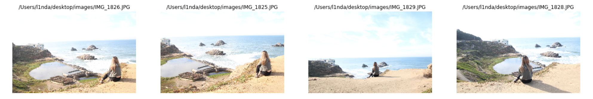
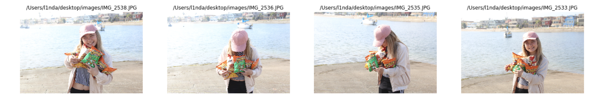
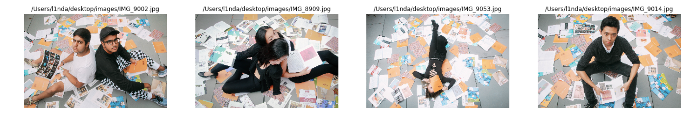
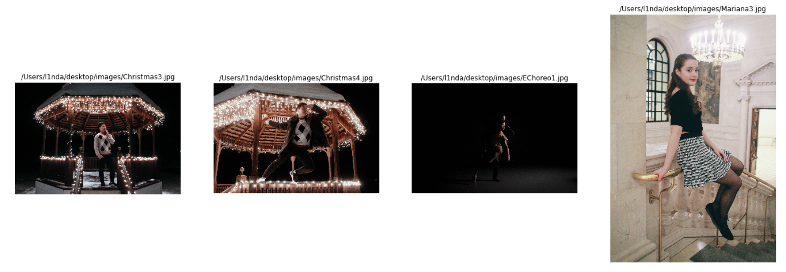
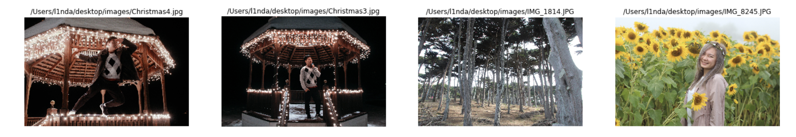

# Image Search

## Find your photos that are most similar

Reusing the activation layer of VGG 16, which was already trained on imagenet,
I ran a database of my images through the CNN, using VGG as a feature extractor,
and then implemented the nearest neighbor algorithm to find the images
that were most similar to the one submitted

#### Example 1

#### Example 2

#### Example 3

#### Example 4

#### Example 5

The second and third nearest neighbor of this photo is not as similar, but it is
super interesting how the feature extractor from VGG was able to still find
similarities through the lights and the clothing patterns in the 3rd NN

#### Example 6

---

### Special Thanks To

The TAVTech Fellowship

Gil Levi; AI instructor
